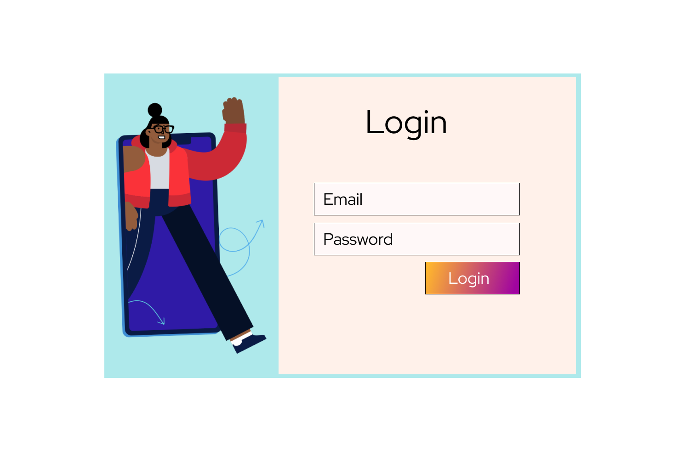

# Contexte du projet

Vous êtes un développeur polyvalent travaillant dans une agence de communication. On vous a donné les tâches suivantes :

- Intégrer une page d'accueil dont on vous a fourni la maquette.
- Réaliser et intégrer le désigne de la page Sign up du site.
- Réaliser et intégrer le désigne de la page Sign in du site.

### Page d'acceuil et intégration

[page d'accueil](https://achaayb.github.io/YOUCODE/1/Designing_an_invitation_landing,_sign_up_and_sign_in_page/index/)

### Page SIgnup et Signin

[Signin](https://achaayb.github.io/YOUCODE/1/Designing_an_invitation_landing,_sign_up_and_sign_in_page/login-register/login.html)
[Signup](https://achaayb.github.io/YOUCODE/1/Designing_an_invitation_landing,_sign_up_and_sign_in_page/login-register/register.html)
